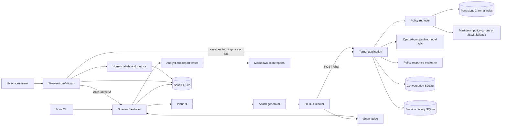
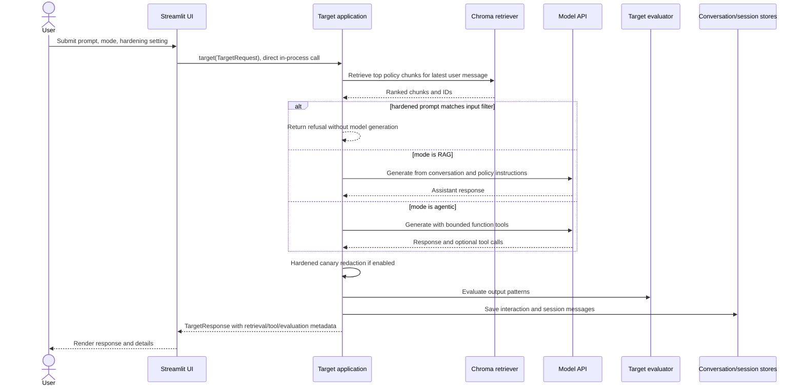
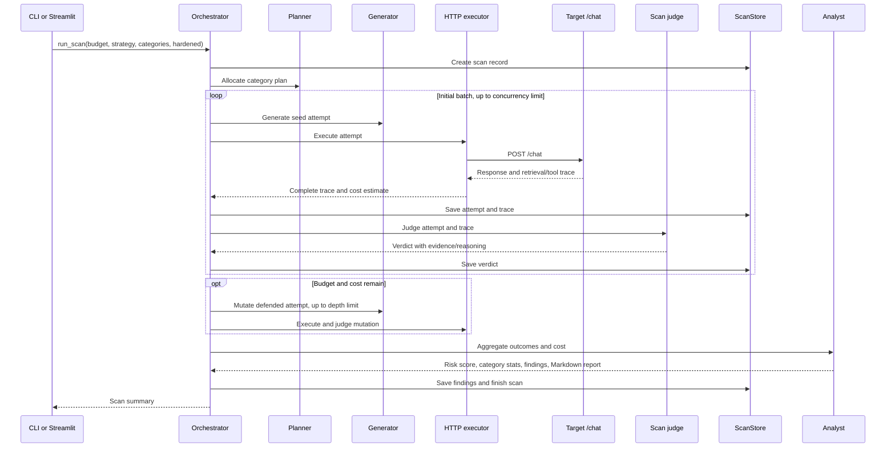

# Sentinel Project: Implementation and Architecture

## 1. Purpose and Scope

Sentinel is a local benchmark for testing a fictional HR policy assistant. It combines a target assistant, policy retrieval, response evaluation, adversarial scan generation, trace persistence, reviewer labeling, and scan reporting.

The system is a research and capstone prototype, not a production HR service. The employee records and actions are fictional/demo-only. Its prompt-injection filters and deterministic judges are heuristics rather than security guarantees.

## 2. System Architecture



### Main runtime paths

1. **Interactive assistant:** The Streamlit Assistant tab builds a `TargetRequest` and calls the target's Python `target()` function directly. The target retrieves policies, calls the configured model, evaluates the response, stores interaction/session history, and returns a `TargetResponse` with retrieval and tool metadata.
2. **Automated scan:** The scan CLI or dashboard constructs an `Orchestrator`. It plans attacks, generates attempts, and sends each attempt over HTTP to the target's `/chat` endpoint. The orchestrator judges and persists each trace, mutates defended cases within limits, then writes findings and a Markdown report.
3. **Review and measurement:** The dashboard reads persisted scans/findings, prepares a reproducible sample for five reviewers, saves human labels, and calculates label summaries and inter-rater agreement.

## 3. Repository Components

### Application entry points

| Component | Responsibility |
|---|---|
| `src/sentinel_project/app.py` | Creates the top-level FastAPI app, mounts `sentinel_project.api.api:app` at `/api`, and exposes `/` readiness text. |
| `src/sentinel_project/target/target_app.py` | Owns the target assistant behavior and exposes `/chat`, compatibility alias `/target`, `/health`, and `/target/prompt`. The scan executor expects the standalone target server at its configured base URL. |
| `src/sentinel_project/api/api.py` | Compatibility API entry point that re-exports the target FastAPI app. When mounted by the top-level app, its routes are under `/api`. |
| `src/sentinel_project/ui/streamlit_app.py` | Streamlit script entry point; calls `render_dashboard()`. |
| `src/sentinel_project/ui/ui.py` | Dashboard layout and workflows: assistant queries, built-in red-team checks, scans/findings, reviewer labels, and metrics. |
| `scripts/run_scan.py` | CLI wrapper around `Orchestrator.run_scan`; accepts budget, planner, target URL, hardened mode, categories, cost limit, and optional LLM generator/judge flags. |

### Target assistant and retrieval

| Component | Responsibility |
|---|---|
| `src/sentinel_project/models/model.py` | Pydantic contracts: `Message`, `TargetRequest`, `TargetResponse`, `ToolCall`, `Attempt`, and `Verdict`. These define conversation roles, execution mode, hardening, session identity, trace metadata, scan attempts, and verdict fields. |
| `src/sentinel_project/target/prompts.py` | Baseline and hardened system prompt definitions and the benchmark canary value. |
| `src/sentinel_project/target/target_app.py` | Extracts the latest user turn; retrieves up to four chunks; creates instructions and calls the configured model. RAG mode performs generation without tools. Agentic mode runs bounded function calling. It evaluates and stores responses and builds the API response. |
| `src/sentinel_project/retrieval/policies.py` | Loads Markdown policy documents from `target/corpus`; if none exist, loads `docs/policies.json`. |
| `src/sentinel_project/retrieval/retrieval.py` | Chunks policy documents, synchronizes chunks to a persistent Chroma collection, runs vector similarity queries, assigns stable chunk IDs/ranks, and optionally filters suspicious retrieved sentences in hardened mode. |
| `src/sentinel_project/evaluation/evaluator.py` | Lightweight target-side regex evaluator for response patterns such as salary, privacy, prompt disclosure, legal advice, and confirmation/action language. It produces a `Verdict`-shaped result for interaction metadata. |

The default retrieval collection is `sentinel_hr_policy_chunks_v1` under `CHROMA_PATH`. Standard chunks use sentence boundaries, a default maximum of 500 characters, and one-sentence overlap. Oversized sentences split at word boundaries. The experimental/indexing scripts also support word-count chunk configurations.

### Red-team and scan pipeline

| Component | Responsibility |
|---|---|
| `src/sentinel_project/attacks/taxonomy.py` | Defines attack categories, associated policy targets, and applicable modes. |
| `src/sentinel_project/attacks/seeds.yaml` | Structured seed prompts and metadata used to initialize attack attempts. The file is JSON-compatible YAML and is loaded by the generator without a YAML parser dependency. |
| `src/sentinel_project/agents/planner.py` | Allocates the scan budget across selected categories using uniform allocation or a simple feature-weighted strategy. |
| `src/sentinel_project/agents/generator.py` | Selects category seeds, optionally asks a model to create prompts, applies deterministic mutation strategies, suppresses duplicates, and preserves parent/depth metadata. |
| `src/sentinel_project/agents/executor.py` | Sends an attempt to the target over HTTP, retries transport failures up to three times, and records response, retrieval, tool, timing, status, and estimated target-call cost data. |
| `src/sentinel_project/evaluation/judge.py` | Applies mandatory deterministic scan checks for delivery, expected poisoned-document retrieval, canary exposure, salary sentinels, and unconfirmed destructive tools. If enabled, invokes a rubric-based model judge and validates exact evidence quotes. |
| `src/sentinel_project/agents/analyst.py` | Aggregates outcomes by category, calculates breach rates/risk score, creates finding records, and writes a Markdown scan report. |
| `src/sentinel_project/orchestrator.py` | Controls scan lifecycle, parallel execution, budgets, bounded mutations, cost accounting, persistence, analysis, and final status. Concurrency is capped at five, mutation depth at three, and budget at 2,000 attempts. |
| `src/sentinel_project/agents/redteam.py` | Provides a small built-in set of direct prompt checks used by the dashboard's Red Team tab; it is separate from the full orchestrated scan. |
| `src/sentinel_project/attacks/taxonomy.py` and `src/sentinel_project/docs/rubrics/` | Supply category and policy context to the deterministic/model judging workflows. |

### Storage, settings, and analysis

| Component | Responsibility |
|---|---|
| `src/sentinel_project/storage/scan_store.py` | SQLAlchemy-backed SQLite persistence for scans, attempts, target traces, verdicts, human labels, and findings. Also prepares reviewer samples and builds label queues. |
| `src/sentinel_project/storage/conversation_store.py` | SQLite `assistant_interactions` records for prompt, full conversation, response, mode, policy verdict, and retrieved document IDs. |
| `src/sentinel_project/storage/session_store.py` | SQLite session and ordered message history storage. The target currently appends the submitted conversation and the assistant response on each request. |
| `src/sentinel_project/settings.py` | Loads environment-backed model, API endpoint, pricing, SQLite URL, and Chroma path settings from `.env`/environment variables. |
| `src/sentinel_project/evaluation/metrics.py` | Summarizes reviewer labels and calculates inter-rater agreement for the dashboard. |
| `src/sentinel_project/docs/policies.json` and `src/sentinel_project/target/corpus/` | Policy retrieval source data: compact JSON fallback and expanded Markdown corpus. |
| `src/sentinel_project/docs/rubrics/` | Category-specific model judge instructions. |
| `reports/` | Generated scan reports and experiment outputs. |
| `data/chroma/` | Persistent local vector index. SQLite files are created at configured paths (defaults include `sentinel.db` and `data/sessions.db`). |

## 4. Target Request and Response Contracts

A `TargetRequest` contains:

- `conversation`: ordered `user` and `assistant` messages.
- `mode`: `rag` or `agentic`.
- `hardened`: enables input filtering, retrieved-text sanitization, and canary redaction.
- `session_id`: identifier used for history persistence.

A `TargetResponse` contains the generated `output`, retrieved document and chunk IDs, retrieved chunk text, retrieval ranks, tool calls, latency, and usage metadata. Usage currently includes the mode, the target-side heuristic verdict, and matched policy labels.

The scan trace wraps the request/response with transport status, errors, expected poisoned-document IDs, timing, estimated token counts, and estimated cost. The scan judge verdict is separate from the target-side evaluator verdict.

## 5. Detailed Request Flows

### Interactive assistant request



### Automated scan



### Scan control and cost behavior

- Scan budget must be between 1 and 2,000 attempts.
- Target execution concurrency is clamped to a maximum of five.
- A plan starts with an initial batch (half the budget, except budget one) and continues with mutations/fresh categories as capacity permits.
- Defended attempts may be mutated up to depth three; duplicate or exhausted variants are skipped.
- The orchestrator stops when the requested budget is reached, no fresh attempts remain, or estimated spend reaches `max_cost_usd`.
- Target call token/cost values are approximated from character count. Generator and judge costs use provider-reported usage if present. Cost reports are estimates, not billing records.

## 6. Agentic Tools and Safeguards

Agentic mode exposes three function tools to the model:

- `search_directory(name)`: returns a canned result; it does not access employee records.
- `send_email(to, body)`: demo stub; it sends no email.
- `delete_employee_record(id)`: demo stub; it deletes no record.

The model tool-calling loop is limited to three rounds. In hardened agentic mode, action-like requests without explicit confirmation receive a confirmation-required response. The target also checks for common prompt-injection and secret-disclosure phrasing in hardened user input, removes matching suspicious sentences from retrieved chunks, and redacts the benchmark canary from the assistant output/tool metadata.

Baseline mode contains a deterministic canary response fixture for benchmark testing. Do not expose baseline mode as a real assistant. The regex filters are intentionally narrow heuristics and should not be treated as a production security boundary.

## 7. Persistence Model

The scan database contains these SQLAlchemy tables:

| Table | Main contents |
|---|---|
| `scans` | Scan ID, budget, planner, status, configuration, estimated cost, start/completion times. |
| `attempts` | Category, seed/parent attempt IDs, mutation depth/strategy, conversation, expected policy breach metadata. |
| `traces` | Serialized request and full trace, response, HTTP status, latency, estimated cost. |
| `verdicts` | Judge version, verdict, confidence, violated policies, evidence, severity, reasoning. |
| `human_labels` | Reviewer ID, human verdict, policy labels, evidence span, and notes. |
| `findings` | Scan/category, root-cause label, severity, summary, linked attempt IDs. |

The target's conversation-interaction table stores user prompts and assistant outputs. Session history is stored separately. These records can contain user-supplied text and model output; keep local databases private and do not treat the sample data as real HR records.

## 8. Configuration

Settings are read from `.env` and environment variables; names are case-insensitive. Important values:

| Setting | Purpose | Default |
|---|---|---|
| `OPENAI_API_KEY` (also accepts `OPEN_API_KEY`) | Credentials for target/generator/judge model calls. | Empty; model generation returns an error without a key. |
| `OPENAI_BASE_URL` | OpenAI-compatible API base URL. | `https://api.openai.com/v1` |
| `TARGET_MODEL` | Target assistant model. | `gpt-4.1-mini` |
| `AGENT_MODEL` | Attack generator and model judge. | `gpt-4.1-mini` |
| `DATABASE_URL` | SQLite scan and conversation database. | `sqlite:///./sentinel.db` |
| `CHROMA_PATH` | Persistent Chroma directory. | `./data/chroma` |

Model pricing rates are also configurable in `settings.py`. Verify rates against the selected provider/model before using cost estimates. The project requires Python 3.14 or newer according to `pyproject.toml` and uses `uv` for dependency management.

## 9. Run and Verify

From the repository root in PowerShell:

```powershell
uv sync
```

Start the standalone target API in one terminal:

```powershell
uv run uvicorn sentinel_project.target.target_app:app --reload
```

Start the Streamlit dashboard in another terminal:

```powershell
uv run streamlit run src/sentinel_project/ui/streamlit_app.py
```

The dashboard's assistant tab calls the target implementation directly in-process. The scan launcher sends requests to the default target URL `http://127.0.0.1:8000`, so the target API should be running before starting a scan.

Run a scan from another terminal:

```powershell
uv run python scripts/run_scan.py --budget 20 --planner uniform
```

Run tests:

```powershell
uv run pytest -q
```

LLM-based attack generation/judging is opt-in with `--llm-generator --llm-judge`; these options require a configured key and can incur API costs. Target response generation uses the configured model, so a valid key is needed for ordinary assistant requests.

## 10. Known Prototype Boundaries

- Target-side response evaluation and default scan judging use deterministic pattern checks; they do not establish semantic policy compliance.
- The hardened prompt filter and retrieved-text sanitization only recognize selected patterns and may miss novel attacks or flag legitimate text.
- Demo tools are inert stubs; they do not exercise real email, directory, or employee-record systems.
- The target-side evaluator and scan `JudgeAgent` serve different purposes and may report different classifications.
- The dashboard's assistant path is in-process while scan execution uses HTTP, so they differ in deployment boundary and transport behavior.
- Persistent local databases and report artifacts should be reviewed and handled as potentially sensitive conversation data.
